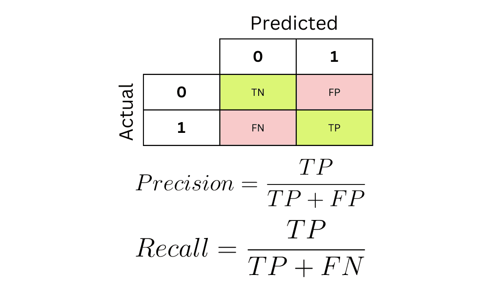
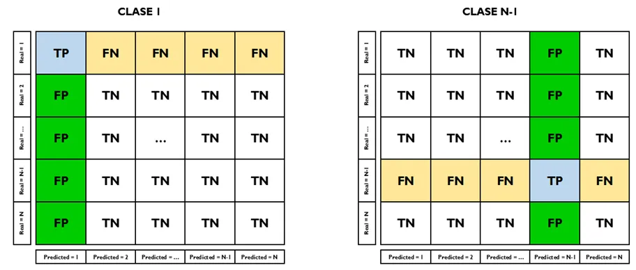

# Week 2 content
## Idea of ML
The idea of ML is to find a function that maps input features to output labels. The goal is to find a function that generalizes well to unseen data. This is done by minimizing the loss function, which measures the distance between the true function and the approximated function. Refer to [Idea of ML](./IdeaOfML.md) for more details.

## Decision Trees and XGBoost
Worked with Decision Trees, XGBoost and scikit-learn:
- Column Transformers: OneHotEncoder and StandardScaler
- Pipelines
- Test Train split
- Various metrics for regression and classification
- Model fitting
- Parameters vs Hyperparameters
- Feature importance
Refer to notebooks [Decision Trees](./DT.ipynb) and [XGBoost](./XGB.ipynb) for the content.

### Multi-Class confusion matrix
We discussed confusion matrix for binary class, but what about multiple classes? For multiclass classification, we get a matrix for each class by considering each class as the "positive" class and all others as "negative" in turn (one-vs-rest approach), and do this iteratively. This results in a square matrix where each row represents the actual class and each column represents the predicted class. The diagonal elements indicate correct predictions, while off-diagonal elements show misclassifications. This helps visualize how well the model distinguishes between multiple classes.

