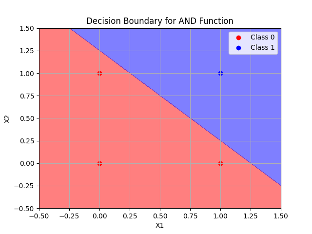
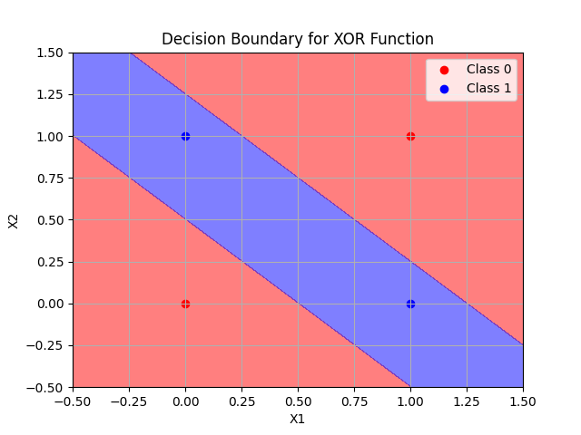
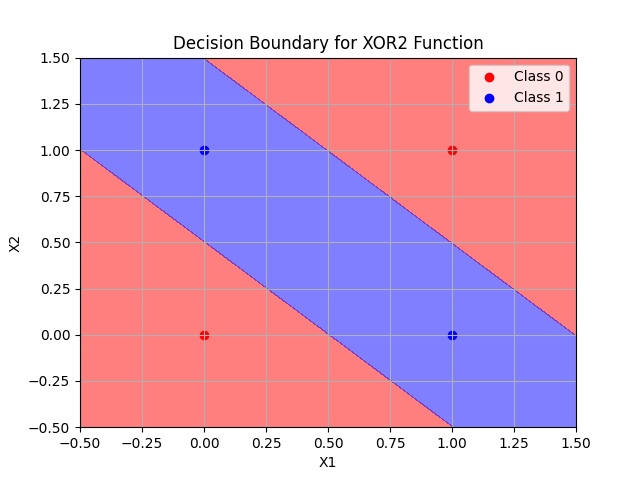
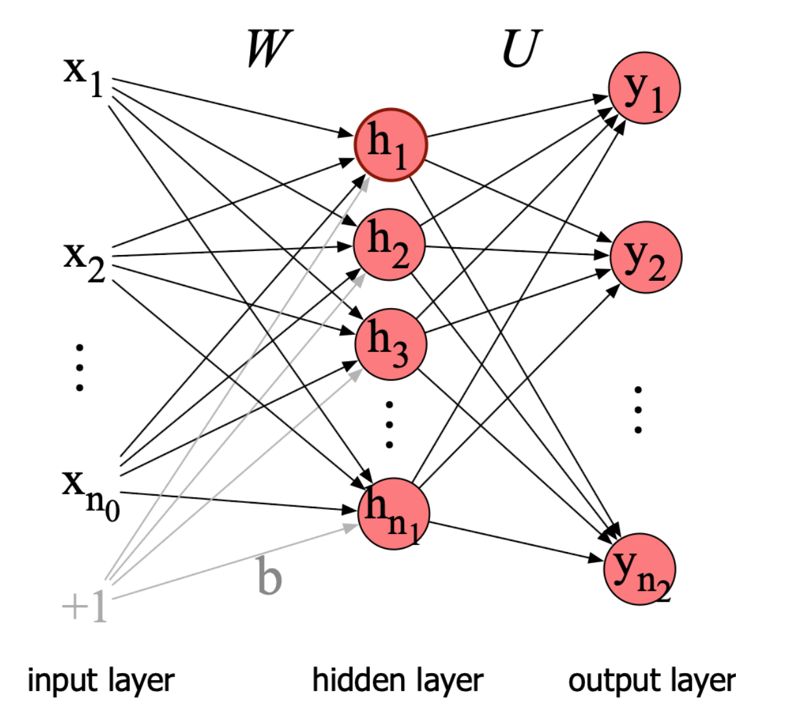

# A shift to Deep Learning
XGBoost is a powerful tool for tabular data, but it depends on feature engineering. There are many cases where no explicit features can be seen like images, text, or audio. In these cases, we can use deep learning to learn the features from the data. We'll begin our shift to deep learning by looking at the Perceptron, which is a single-layer neural network. We'll then look at the MLP (Multi-Layer Perceptron), which is a multi-layer neural network. The MLP is a more powerful model than the Perceptron, and it can learn more complex functions. 

## Perceptron
The Perceptron is a simple model that can be used for binary classification. It is given by the function:
$$
f(x) = SIGN(w^T x + b)
$$
where $w$ is the weight vector, $b$ is the bias, and $SIGN$ is the activation function. The Perceptron uses the step function as the activation function:
$$
SIGN(x) = \begin{cases}
1 & \text{if } x > 0 \\
0 & \text{otherwise}
\end{cases}
$$
Perceptron is very good at classifying linearly separable data, like the AND and OR functions. 

But it's hopeless against non-linearly seperable functions like XOR. What to do?

## Multi-Layer Perceptron: Stacking Perceptrons
The solution is to stack Perceptrons on top of each other. This is called a Multi-Layer Perceptron (MLP). The MLP is a feedforward neural network that consists of an input layer, one or more hidden layers, and an output layer. Each layer consists of a number of neurons, which are connected to the neurons in the previous and next layers. The MLP can learn complex functions by combining the outputs of the neurons in the hidden layers.

### $W$ as a matrix instead of a vector
We want to stack Perceptrons on top of each other. To do this, we need to change the way we represent the weights. We want intermediate layers to be vectors, and the final layer to be a scalar. To do this, we need to change the way we represent the weights. Instead of representing the weights as a vector, we represent them as a matrix. The function is now:
$$
f(x) = SIGN(Wx + b)
$$
where $W$ is a matrix of weights, $x$ is a vector of inputs, and $b$ is a vector of biases. 

### Activation function
Note that directly stacking Perceptrons on top of each other will not work. Composition of several linear functions is still a linear function. We need to add a non-linear activation function to the neurons in the hidden layers to introduce non-linearity. 

A few common activation functions are:
- Sigmoid: $\sigma(x) = \frac{1}{1 + e^{-x}}$ (applied at final layer)
- ReLU: $ReLU(x) = \max(0, x)$ (applied at hidden layers)
- Softmax: $Softmax(x_i) = \frac{e^{x_i}}{\sum_{j=1}^K e^{x_j}}$ for $i=1,2,...,K$ (applied at final layer)
- Linear: $Linear(x) = x$ (for regression tasks)

### What do the outputs mean?
If the final layer is a sigmoid, we can treat the output as a probability of a binary class. If the final layer is a softmax, we can treat the output as a probability distribution over multiple classes. The softmax function is used for multi-class classification problems, where we want to predict the probability of each class. The softmax function takes a vector of real numbers and converts it into a probability distribution. The output of the softmax function is a vector of probabilities that sum to 1.

For regression tasks, we can use a linear activation function in the final layer. The output of the linear activation function is a real number, which can be used to predict a continuous value.

### Solving XOR
A double layered MLP can solve the XOR problem. The first layer learns to separate the data into two classes, and the second layer learns to combine the outputs of the first layer to produce the final output. The MLP can learn to classify the XOR function by using a combination of the AND and OR functions.

### Genralization
A $k$-layer perceptron can be represented as:
$$
f(x) = \sigma_k(W_k \cdot \sigma_{k-1}(W_{k-1} \cdots \sigma_2(W_2 \cdot \sigma_1(W_1 x + b_1) + b_2) \cdots + b_{k-1}) + b_k)
$$
where $\sigma_i$ is the activation function of layer $i$, $W_i$ is the weight matrix of layer $i$, and $b_i$ is the bias vector of layer $i$. The MLP can learn to approximate any continuous function by using a sufficient number of hidden layers and neurons.

### Training the MLP
Refer to [this](./Training.md)

## Neural Networks
Another word for MLP is a neural network. The term "neural network" is used to describe a class of models that are inspired by the structure and function of the human brain. Neural networks are composed of layers of interconnected nodes, or neurons, that process information in parallel. Each neuron receives input from other neurons, applies a non-linear activation function, and produces an output that is sent to other neurons in the next layer.