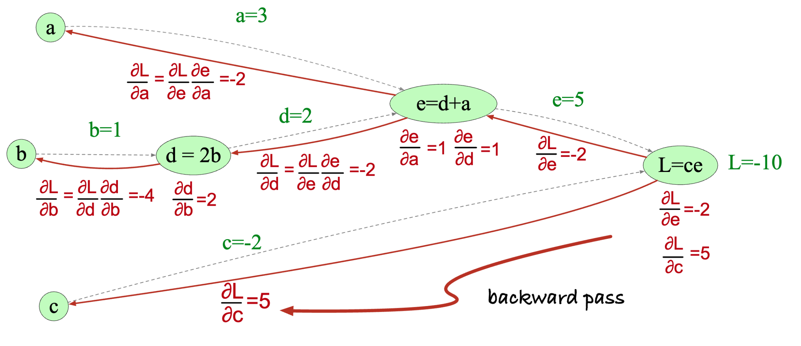

## What's training?
Training is the process of finding the parameters of the model that minimize the loss function. This is done by using an optimization algorithm, which is a method to find the minimum of a function. The most common optimization algorithm used in machine learning is **Gradient Descent**.

## The Procedure
Our aim is to find the parameters that minimize the loss function, but the obtained model must also be able to generalize well to unseen data. This is called **Generalization**. The process of training a model involves the following steps:
1. Split the data into training and testing sets. The training set is the one used to find the parameters of the model, while the testing set is used to evaluate the performance of the model, and act as a proxy for unseen data.
2. Choose a model and a loss function. The model is the class of functions we restrict ourselves to, and the loss function is the measure of distance between the true function and the approximated function.
3. Choose an optimization algorithm. The most common optimization algorithm used in machine learning is **Gradient Descent**.
4. Initialize the parameters of the model. This is usually done by randomly initializing the parameters.
5. Train the model by iteratively updating the parameters using the optimization algorithm.
6. Evaluate the performance of the model on the testing set. This is done by calculating the loss on the testing set.
7. If the performance is satisfactory, we can use the model to make predictions on unseen data. If not, we can go back to step 2 and try a different model or loss function.

**NEVER USE THE TESTING SET TO TRAIN THE MODEL.** The testing set is used to evaluate the performance of the model, and should not be used to find the parameters of the model. This is called **Data Leakage**, and can lead to overfitting, which is when the model performs well on the training set, but poorly on unseen data.

## The Optimization Algorithm
The most common optimization algorithm used in machine learning is **Gradient Descent**. The idea behind gradient descent is to iteratively update the parameters of the model in the direction of the negative gradient of the loss function. The gradient is a vector that points in the direction of the steepest increase of the function, and the negative gradient points in the direction of the steepest decrease. By moving in the direction of the negative gradient, we can find the minimum of the function.
The update rule for gradient descent is given by:
$$
\theta_{t+1} = \theta_t - \eta \nabla L(\theta_t)
$$
where $\theta_t$ is the vector of parameters at iteration $t$, $\eta$ is the learning rate, and $\nabla L(\theta_t)$ is the gradient of the loss function with respect to the parameters at iteration $t$. The learning rate is a hyperparameter that controls the step size of the update. A small learning rate will result in slow convergence, while a large learning rate may cause the algorithm to diverge.

### The Gradients
The gradients for immediate layers are calculated using the chain rule. The chain rule is a fundamental theorem in calculus that allows us to calculate the derivative of a composite function.

This is called **Backpropagation**. The idea is to propagate the error from the output layer back to the input layer, and update the weights of each layer based on the error.

### Hyperparameters
Hyperparameters are parameters that are not learned from the data, but are set before training the model. These include the learning rate, the number of iterations, the batch size, etc. The choice of hyperparameters can have a significant impact on the performance of the model. Hyperparameter tuning is the process of finding the best hyperparameters for a given model and dataset. This is usually done by using a validation set, which is a subset of the training set that is used to evaluate the performance of the model during training. We'll discuss hyperparameter tuning in detail later.

The most important hyperparameters here are:
- **Learning Rate**: The learning rate is a hyperparameter that controls the step size of the update. A small learning rate will result in slow convergence, while a large learning rate may cause the algorithm to diverge.
- **Epochs**: An epoch is one complete pass through the training set. The number of epochs is the number of times the model will be trained on the training set. A small number of epochs may result in underfitting, while a large number of epochs may result in overfitting.

### Analogy
Let's demonstrate gradient descent with an analogy. Imagine you're in a dark night on a mountain, and you want to find the lowest point in the valley. You can't see anything, but you can feel the slope of the ground beneath your feet. You can use this information to take small steps in the direction of the steepest descent. By iteratively taking small steps in the direction of the steepest descent, you can find the lowest point in the valley. This is similar to how gradient descent works.

### Various Loss Functions
There are many different loss functions that can be used for different types of problems. The most common loss functions are:
- **Mean Squared Error (MSE)**: This is the most common loss function used for regression problems. It measures the average squared difference between the predicted and true values. The formula for MSE is given by:
$$
L(y, \hat{y}) = \frac{1}{n} \sum_{i=1}^{n} (y_i - \hat{y}_i)^2
$$
where $y_i$ is the true value, $\hat{y}_i$ is the predicted value, and $n$ is the number of samples.
- **Binary Cross-Entropy**: This is the most common loss function used for binary classification problems. It measures the difference between the predicted probability and the true label. The formula for binary cross-entropy is given by:
$$
L(y, \hat{y}) = -\frac{1}{n} \sum_{i=1}^{n} [y_i \log(\hat{y}_i) + (1 - y_i) \log(1 - \hat{y}_i)]
$$
where $y_i$ is the true label (0 or 1), $\hat{y}_i$ is the predicted probability, and $n$ is the number of samples.
- **Categorical Cross-Entropy**: This is the most common loss function used for multi-class classification problems. It measures the difference between the predicted probability distribution and the true probability distribution. The formula for categorical cross-entropy is given by:
$$
L(y, \hat{y}) = -\frac{1}{n} \sum_{i=1}^{n} \sum_{j=1}^{k} y_{ij} \log(\hat{y}_{ij})
$$
where $y_{ij}$ is the true probability distribution (one-hot encoded), $\hat{y}_{ij}$ is the predicted probability distribution, $k$ is the number of classes, and $n$ is the number of samples.
