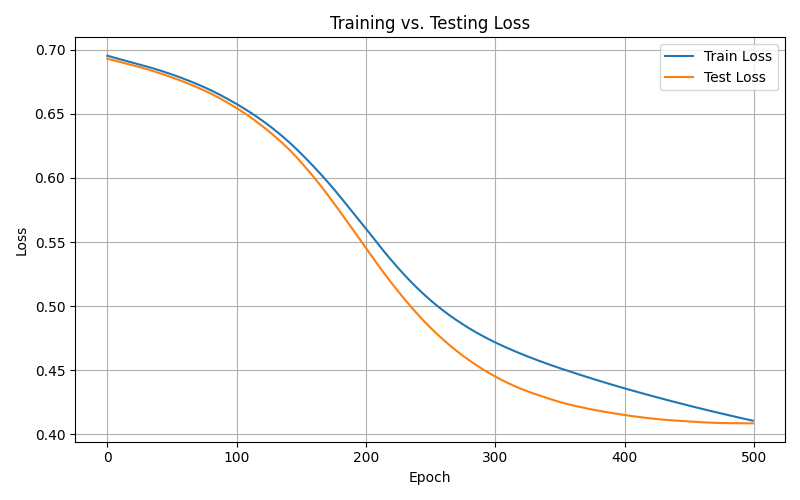

# Titanic Survival Prediction with PyTorch

This project uses a simple Multilayer Perceptron (MLP) built with PyTorch to predict survival on the Titanic dataset. It shows how to load data, build a model, train it, and plot the training and test loss.

## How to Run

1. Install the required libraries:

```bash
pip install -r requirements.txt
```

2. Place the Titanic dataset CSV in the `dataset/` folder

3. Run the training script:

```bash
python3 main.py
```

## Training Results



