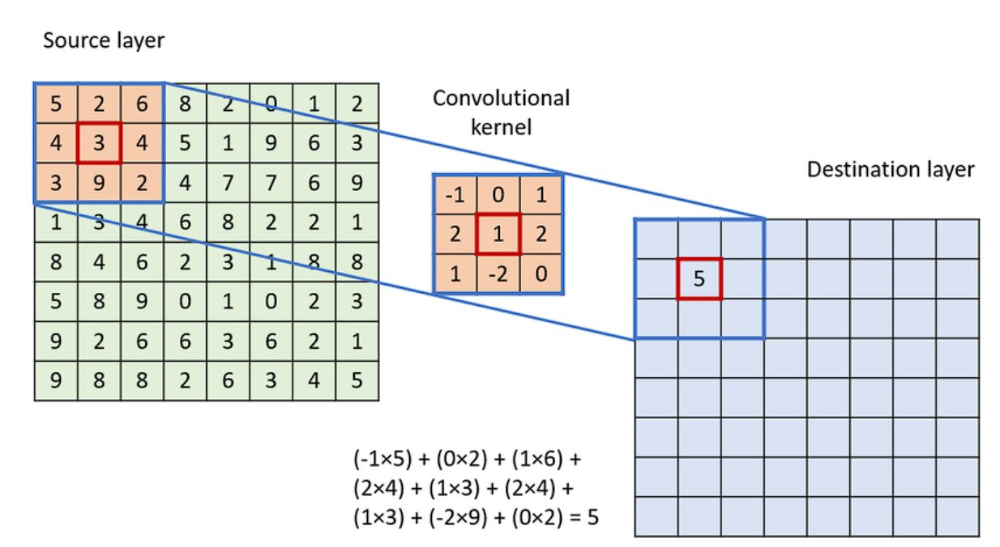
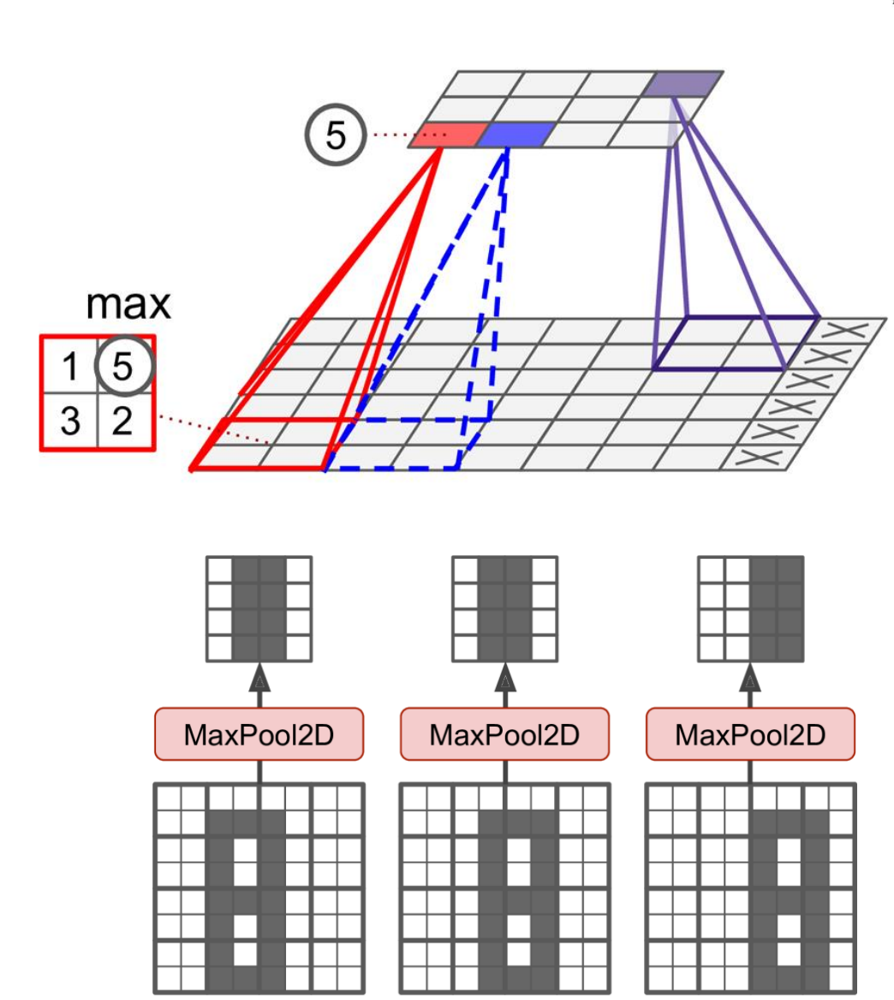

# Convolutional Neural Networks (CNNs)
Vision is a local phenomenon, and CNNs are designed to take advantage of this locality. They use convolutional layers to process data with a grid-like topology, such as images. CNNs are particularly effective for tasks like image classification, object detection, and segmentation.

## Convolution Operation
Just like how dense layers perform flattening and matrix multiplication, convolutional layers do the same thing but over a local region of the input. The convolution operation involves sliding a filter (or kernel) over the input data and computing the dot product at each position. This allows CNNs to capture local patterns and features in the data.

If input is an image of size $H \times W \times C$ (height, width, channels), and the filter is of size $F \times F \times C$, the output feature map will be of size $(H - F + 1) \times (W - F + 1) \times K$, where $K$ is the number of filters used.

Moreover, the filter can move with a stride $S$ (the number of pixels the filter moves at each step), which can further affect the output size. The output size can be calculated as:
$$
\text{Output Height} = \frac{H - F + 2P}{S} + 1 \\
\text{Output Width} = \frac{W - F + 2P}{S} + 1
$$
where $P$ is the padding applied to the input.

## Number of parameters
In a dense layer with parameters $W (m\times n)$ and $b (n \times 1)$, the number of parameters is given by:
$$
\text{Number of Parameters} = m \times n + n
$$
where $m$ is the number of input channels, $n$ is the number of output channels, and $b$ is the bias term.

However, in a convolutional layer with a filter of size $F \times F \times C$ and $K$ filters, the number of parameters is given by:
$$
\text{Number of Parameters} = F \times F \times C \times K + K
$$
where $F$ is the filter size, $C$ is the number of input channels, and $K$ is the number of filters. This shows that convolutional layers can have significantly fewer parameters than dense layers, especially for large input sizes.

## Pooling Layers
Pooling layers are used to reduce the spatial dimensions of the input feature maps, which helps in reducing the number of parameters and computation in the network. The most common pooling operation is max pooling, which takes the maximum value from a local region of the feature map.

Max pooling is typically applied with a filter size of $F \times F$ and a stride of $S$. The output size after max pooling can be calculated similarly to the convolution operation:
$$
\text{Output Height} = \frac{H - F}{S} + 1 \\
\text{Output Width} = \frac{W - F}{S} + 1
$$
where $H$ and $W$ are the height and width of the input feature map, respectively.
