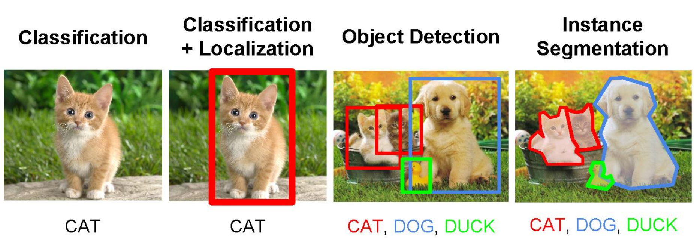

# Computer Vision
Computer Vision is a field of artificial intelligence that enables machines to interpret and understand visual information from the world. It involves the development of algorithms and models that can analyze images and videos, recognize objects, and extract meaningful information.

## Key Problems in Computer Vision
1. **Image Classification**: Assigning a label to an entire image based on its content.
2. **Object Detection**: Identifying and localizing multiple objects within an image.
3. **Instance Segmentation**: Identifying and segmenting individual objects in an image.
4. **Semantic Segmentation**: Assigning a class label to each pixel in an image, effectively segmenting the image into regions of interest.
5. **Pan-optic Segmentation**: Combining semantic and instance segmentation to provide a complete understanding of the image.
