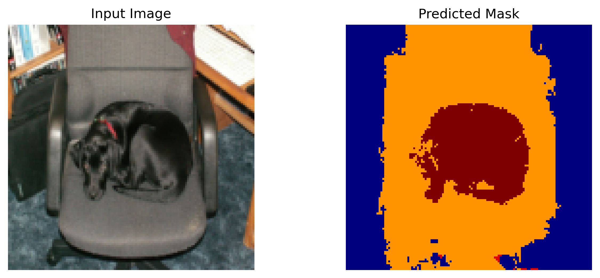

# Semantic Segmentation
Semantic segmentation is a type of image segmentation where each pixel in an image is classified into a category. This means that all pixels belonging to the same object class are assigned the same label, allowing for detailed understanding of the scene.

# How does it work?
Semantic segmentation typically involves using convolutional neural networks (CNNs) to classify each pixel in the image. The network is trained on a dataset where each pixel is labeled with its corresponding class. The output of the network is a pixel-wise classification map, where each pixel is assigned a class label.

We use Fully Convolutional Networks (FCNs) for semantic segmentation. FCNs replace the fully connected layers in traditional CNNs with convolutional layers, allowing the network to output a spatial map of class predictions instead of a single label. We start with a pretrained ResNet model, remove the fully connected layers, and add upsampling layers to restore the spatial dimensions of the input image.

Thus the ouput is same size as input image, but each pixel contains a class label. The network learns to recognize patterns and features in the image that correspond to different classes, allowing it to segment the image into meaningful regions.