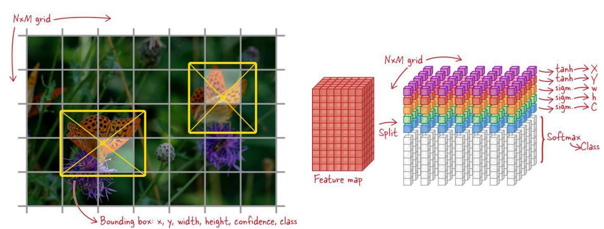
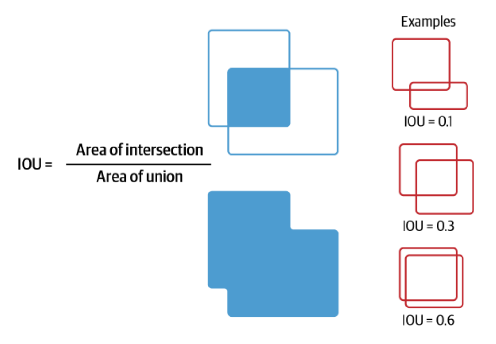

# Object Detection with YOLO
YOLO (You Only Look Once) is a popular real-time object detection system that can detect multiple objects in images and videos. It uses a single convolutional neural network (CNN) to predict bounding boxes and class probabilities directly from full images in one evaluation.

# How does it work?
YOLO treats object detection as a single regression problem, that is, it outputs 5 numbers for each bounding box: the x and y coordinates of the center of the box, the width and height of the box, and the confidence score that indicates how likely it is that the box contains an object. Additionally, it predicts class probabilities for each bounding box.

Given an input image, YOLO divides the image into a grid. Then, sliding a fixed-size window across the grid, it predicts bounding boxes and class probabilities for each grid cell. The model uses anchor boxes to predict multiple bounding boxes per grid cell, allowing it to detect multiple objects of different sizes. That is, for every grid cell, YOLO predicts:
$$
tx, ty, tw, th, o, p(c_1), p(c_2), ..., p(c_n)\\
x = sigmoid(tx) + i\\
y = sigmoid(ty) + j\\
w = p(w_0) * e^{tw}\\
h = p(h_0) * e^{th}\\
$$
where $i$ and $j$ are the grid cell indices, $p(c_k)$ is the probability of class $k$, and $w_0$ and $h_0$ are the dimensions of the anchor boxes.

Often prediction is done at multiple scales to capture objects of different sizes. The final output is a set of bounding boxes with associated class probabilities.

# Some terms:
- **Bounding Box**: A rectangle that encloses an object in the image, defined by its center coordinates, width, and height.
- **Anchor Box**: A predefined bounding box shape used to predict the dimensions of objects in the image.
- **IoU (Intersection over Union)**: A metric used to evaluate the accuracy of the predicted bounding boxes by measuring the overlap between the predicted box and the ground truth box.

- **Confidence Score**: A score that indicates how confident the model is that a predicted bounding box contains an object. It's the product of the objectness score (how likely it is that an object exists in the box) and the IoU score (how well the predicted box overlaps with the ground truth box).
- **Class Score**: The probability that the predicted bounding box belongs to a specific class. It's the product of the confidence score and the class probability.
- **Non-Maximum Suppression (NMS)**: A technique used to filter out overlapping bounding boxes by keeping only the box with the highest confidence score and removing others that have a high IoU with it. It works by sorting the predicted boxes by their confidence scores and iteratively removing boxes that have a high IoU with the box with the highest score until no more boxes remain.
- **mAP (mean Average Precision)**: A metric used to evaluate the performance of object detection models. It is calculated by averaging the precision at different recall levels across all classes.